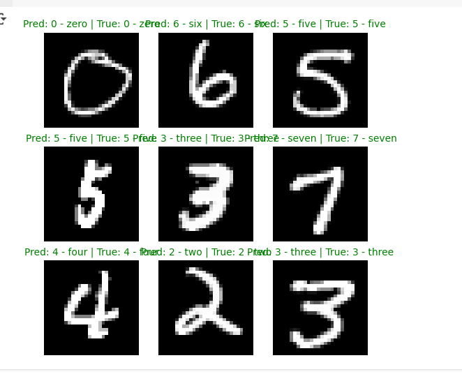
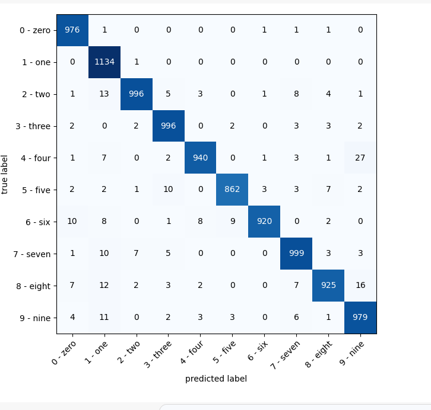

# MNISTModel
A convolutional neural network (CNN) built with PyTorch for handwritten digit classification using the MNIST dataset. The model is trained from scratch and includes evaluation metrics like accuracy and a confusion matrix, plus sample predictions and model saving/loading functionality.

This project is part of my hands-on practice while taking the _PyTorch for Deep Learning Bootcamp_. It’s a personal trial that applies what I’ve learned from the course’s section on **Computer Vision**.
## 📂 Features

- ✅ CNN architecture built with torch.nn.Sequential
- ✅ Training and testing loops with accuracy tracking
- ✅ Visualization of predictions on test samples
- ✅ Confusion matrix for performance evaluation
- ✅ Model saving and loading with torch.save and torch.load

---

## 🛠 Tech Stack

- Python 3.10+
- PyTorch
- torchvision
- matplotlib
- tqdm
- torchmetrics
- mlxtend

---

## 📸 Sample Predictions

The model visualizes predictions on 9 random test images. Predictions are shown in:
- 🟩 Green if correct
- 🟥 Red if incorrect

---

## 📈 Confusion Matrix

A confusion matrix is generated using torchmetrics and visualized with mlxtend to show how well the model performs across all digit classes.

---

## 🧪 Training Results (Example)
-------
Epoch: 0 |
---------
Train Loss: 1.42 | Train Acc: 47.12%
Test Loss: 0.18986 | Test Acc: 94.24%
Epoch: 1 |
---------
Train Loss: 0.13 | Train Acc: 95.91%
Test Loss: 0.08603 | Test Acc: 97.32%
Epoch: 2 |
---------
Train Loss: 0.09 | Train Acc: 97.12%
Test Loss: 0.08244 | Test Acc: 97.25%
## 📸 Sample Predictions

Random 3×3 grid of MNIST test images with model predictions.

- ✅ Correct predictions are shown in **green**
- ❌ Incorrect predictions are shown in **red**

---

## 📊 Confusion Matrix

Generated using `torchmetrics` and plotted using `mlxtend` to evaluate performance across all 10 classes.

## Made by Dagim Wubeante
